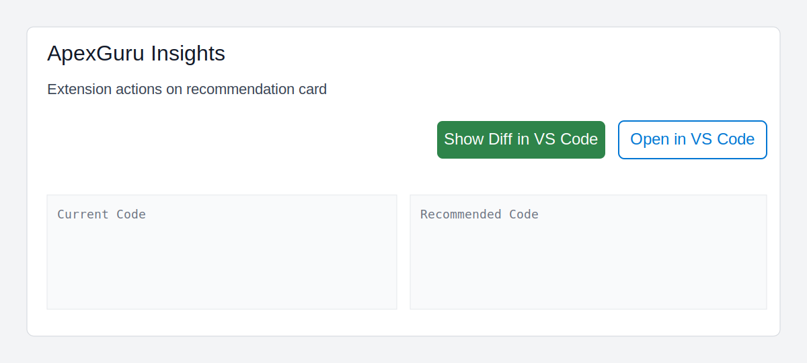
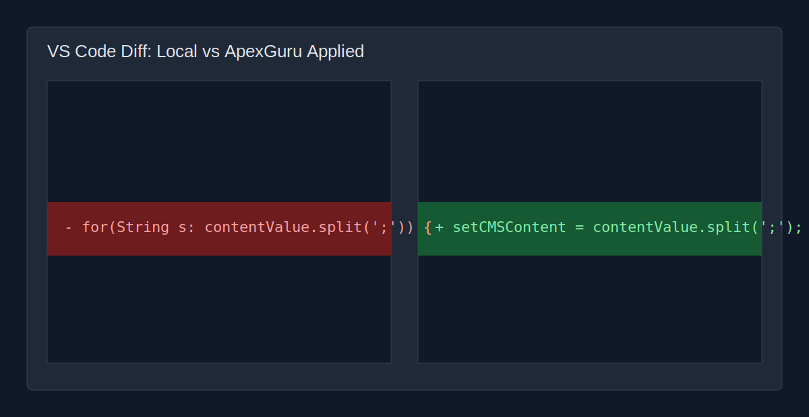

# apex-guru-insight-2-code

Integration between Salesforce ApexGuru Insights and VS Code.

This repo contains two extensions:

- `chrome-extension/` - injects actions into ApexGuru Insights page.
- `vscode-extension/` - VS Code URI bridge (`apexguru.bridge`) that opens files/diffs.

## Features

- `Show Diff in VS Code` (primary)
  - Builds a new file by applying ApexGuru recommendation to local source using ApexGuru line numbers.
  - Opens diff: local file vs applied result.
- `Open in VS Code` (secondary)
  - Opens matched Apex class file directly.

## Project Structure

- `chrome-extension/`
- `vscode-extension/`
- `docs/screenshots/`

## Setup

### 1) Install Chrome extension

1. Open `chrome://extensions`
2. Enable `Developer mode`
3. Click `Load unpacked`
4. Select `chrome-extension/`

Chrome option:

- `Apex classes path (optional)`
  - If set, uses `<classesPath>/<ClassName>.cls` first.
  - If empty, VS Code extension searches current workspace.

### 2) Package and install VS Code extension

```bash
cd vscode-extension
npx @vscode/vsce package
```

Then in VS Code:

1. `Extensions: Install from VSIX...`
2. Select generated `bridge-0.1.0.vsix`
3. Reload VS Code

## Screenshots

ApexGuru page with injected buttons:



VS Code diff (local vs ApexGuru applied):



## Notes

- URI handler is fixed to `vscode://apexguru.bridge/...`
- If you see "apexguru.bridge not found", install VSIX in the same VS Code app handling `vscode://` links.
