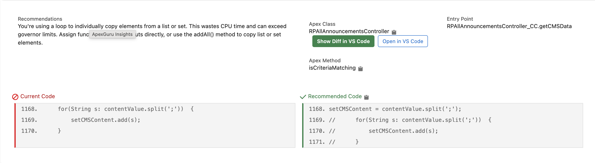
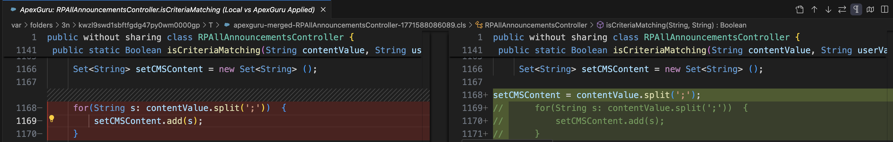

# ApexGuru to VS Code

Integration between Salesforce ApexGuru Insights and VS Code.

This repo contains two extensions:

- `chrome-extension/` - injects actions into ApexGuru Insights page.
- `vscode-extension/` - VS Code URI bridge (`apexguru.bridge`) that opens files/diffs.

## Features

- `Show Diff in VS Code` (primary)
  - Builds a new file by applying ApexGuru recommendation to local source using ApexGuru line numbers.
  - Opens diff: local file vs applied result.
- `Open in VS Code` (secondary)
  - Opens matched Apex class file directly.

## Project Structure

- `chrome-extension/`
- `vscode-extension/`
- `docs/screenshots/`

## Install

### 1) Chrome extension

Install from the [Chrome Web Store](https://chromewebstore.google.com/detail/apexguru-to-vs-code).

Chrome option:

- `Apex classes path (optional)`
  - If set, uses `<classesPath>/<ClassName>.cls` first.
  - If empty, VS Code extension searches current workspace.

### 2) VS Code extension

Install from the [VS Code Marketplace](https://marketplace.visualstudio.com/items?itemName=apexguru.apexguru-insight-bridge).

## Screenshots

ApexGuru page with injected buttons:

VS Code diff (local vs ApexGuru applied):

## Notes

- URI handler is fixed to `vscode://apexguru.bridge/...`
- If you see "apexguru.bridge not found", install VSIX in the same VS Code app handling `vscode://` links.
